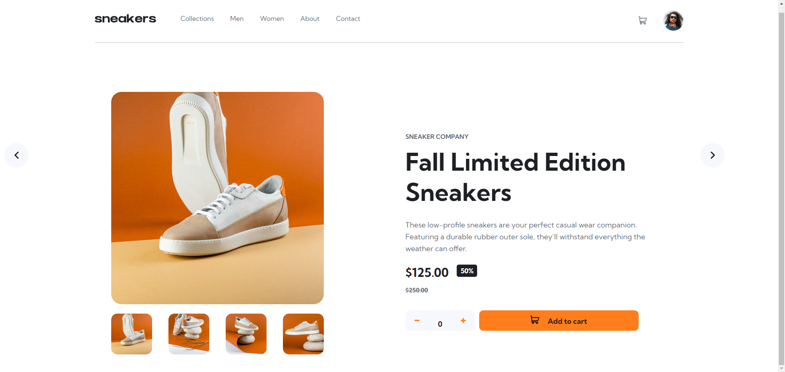

# Frontend Mentor - E-commerce product page solution

This is a solution to the [E-commerce product page challenge on Frontend Mentor](https://www.frontendmentor.io/challenges/ecommerce-product-page-UPsZ9MJp6).

## The challenge

Users should be able to:

- View the optimal layout for the site depending on their device's screen size
- See hover states for all interactive elements on the page
- Open a lightbox gallery by clicking on the large product image
- Switch the large product image by clicking on the small thumbnail images
- Add items to the cart
- View the cart and remove items from it

### Screenshot

### Links

- Solution URL: https://github.com/saccoViola/E-commerce-product-page.github.io
- Live Site URL: https://saccoviola.github.io/E-commerce-product-page.github.io/

## My process

I started this project by sketching a wireframe on paper to plan the structure and identify the main HTML elements and CSS classes I would need.
Then, I wrote the HTML and CSS code, building the page from top to bottom.
I chose to use vanilla JavaScript because I wanted to challenge myself and improve my logic skills before moving on to frameworks like React.
It was a challenging process, and there are still a few things I’d like to refine, but I’m proud of what I achieved and how much I learned along the way.

### Built with

- Semantic HTML5 markup
- CSS custom properties
- Flexbox
- Vanilla Javascript

### What I learned

JavaScript DOM manipulation: I used vanilla JavaScript to handle the lightbox modal, image gallery, and cart functionality — improving my understanding of event listeners, class toggling, and dynamic content updates.

Managing state in a simple app: even without a framework, I learned how to manage the state of the shopping cart, updating item quantity and total dynamically.

Debugging and problem-solving: some features, like syncing the thumbnail gallery with the main image or hiding/showing the cart, were tricky at first. Solving them helped me improve my logical thinking and attention to detail.

